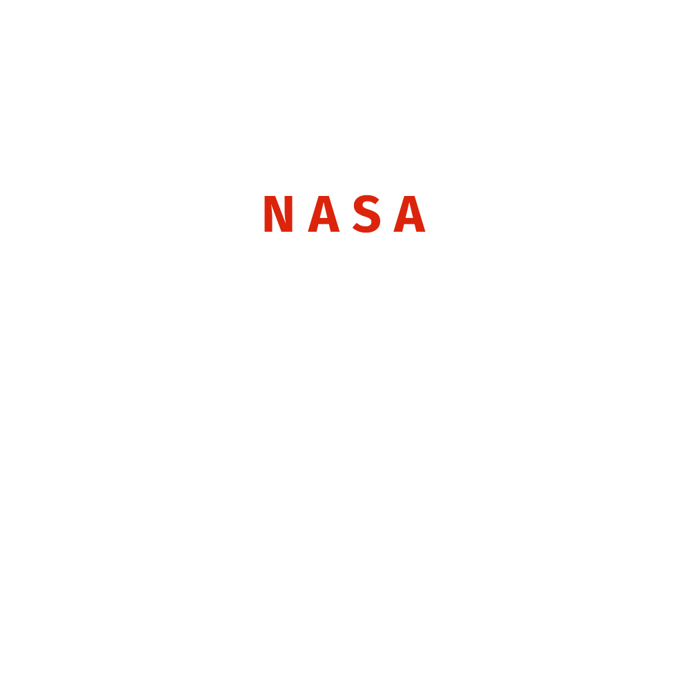

# NASA Space Apps Challenge Brasília 2026 - Equipe Organizadora

  <b>Repositório oficial da landing page e portal de recrutamento para a equipe organizadora do NASA Space Apps Challenge Brasília 2026.</b>

  
  
  

---

## Sobre o Projeto

Este repositório contém o código-fonte da landing page desenvolvida para atrair, informar e selecionar voluntários para a **equipe organizadora do NASA Space Apps Challenge Brasília 2026**. 

O **NASA Space Apps Challenge** é o maior hackathon do mundo, promovido globalmente pela NASA, reunindo cientistas, tecnólogos, designers, programadores e entusiastas do espaço para solucionar desafios reais da Terra e do universo utilizando dados abertos.

A organização local em Brasília busca formar uma equipe multidisciplinar e apaixonada para proporcionar uma experiência inesquecível nos dias **14 e 15 de novembro de 2026**.

---

## O que a plataforma oferece?

* **Apresentação do Evento:** Informações claras sobre o escopo global e local do hackathon.
* **Benefícios de Organizar:** Destaque para oportunidades de *networking*, desenvolvimento de liderança, gestão de projetos e impacto comunitário.
* **Perfis Buscados:** Descrição detalhada das competências e atitudes esperadas dos novos membros (vontade de construir, responsabilidade, iniciativa, trabalho em equipe).
* **FAQ Interativo (Perguntas Frequentes):** Esclarecimento de dúvidas comuns (voluntariado, carga horária, não exigência de exclusividade em tecnologia, etc.).
* **Chamada para Ação (CTA):** Links diretos para inscrições de novos membros na equipe organizadora.

---

## ❓ Perguntas Frequentes (FAQ)

* **Preciso ser estudante de tecnologia?** Não. O evento precisa de pessoas de diversas áreas (comunicação, design, gestão, logística, etc.).
* **Preciso ter experiência em eventos?** Não é obrigatório, a experiência é um diferencial bem-vindo.
* **O trabalho é voluntário?** Sim, a organização é 100% voluntária, movida por paixão por ciência e inovação.
* **Qual o período do evento?** 14 e 15 de novembro de 2026.

---

## 📞 Contato

Para dúvidas, parcerias ou mais informações sobre como fazer parte da organização:

* **E-mail:** `nasaspaceappsbsb@gmail.com`

